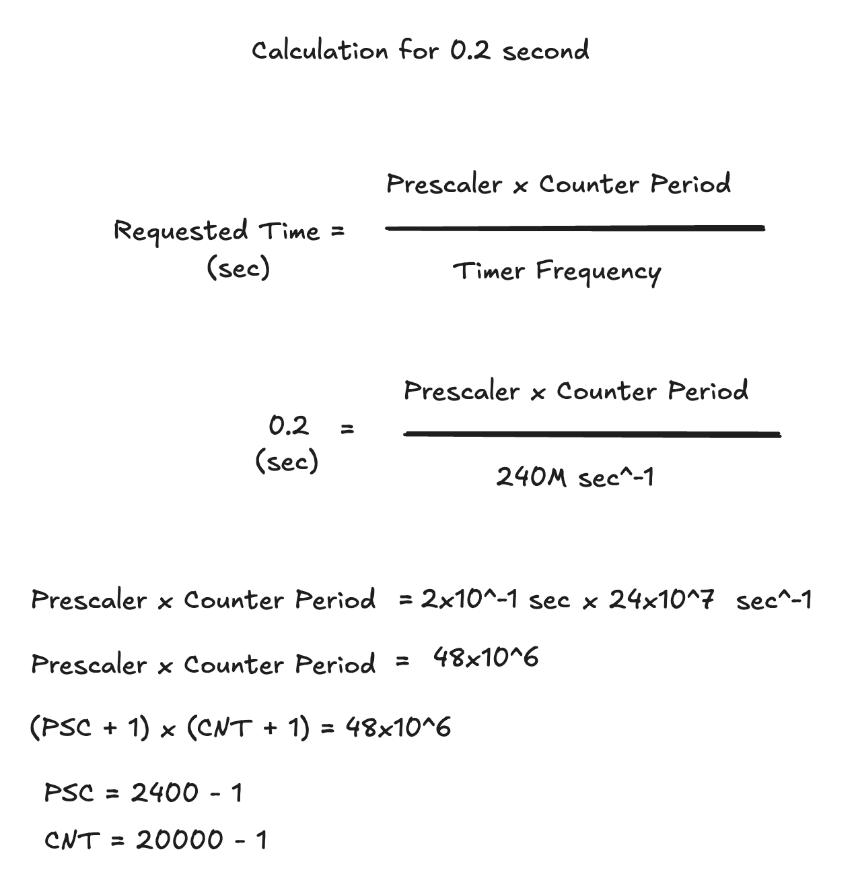

In this example, a Timer application has been prepared for STM32H743. For a specific value, we will calculate and code a timer with a period of 0.2 seconds.

TIM1 peripheral will be used in the application. For this reason, we must first find out which bus this peripheral is connected to. According to the datasheet, STM32H743 ABP2 Bus is used. CubeMX Clock values have not been changed. ABP2 x 2 Clock speed is used for ABP2 Timer and TIM1 will be used with 240 MHz Clock. 

TIM1 values are calculated as follows:
The multiplication of the Prescaler and Counter period values divided by the Timer Frequency gives the value in seconds. Think of it like this. There is a Clock source. This source pulses 240 million times per second. You count this and process according to the number. When this number is 240 million, which is the full period, 1 second passes. Here, if we equate the multiplication of these values to 240 million and say TIMER will create an interrupt in this counting process, we have a 1-second Timer. You can calculate how long you need a Timer specific to your own project with this logic. The thing to remember here is that in embedded systems, values start from zero. So when you want to count 1000, think of it as between 0-999. In this way, it should actually be considered as Prescaler = ( PSC + 1) and Counter = (CNT + 1). Also these PSC and CNT values are 16bit values. Their maximum value is 65535. Pay attention to this when you factorize and do not give a number above this value.

TIM2 peripheral is also added to the project to make PWM with Timer. There will be a signal in 10 ms period and a smooth appearance will be obtained by changing the duty cycle continuously. For this, a calculation similar to the calculation given above was made and the necessary parameters for 10 ms were determined. 